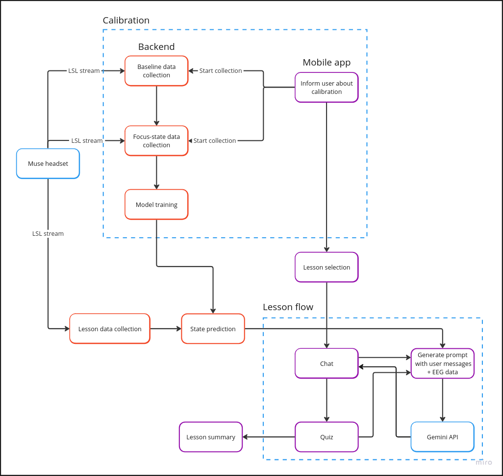

# MindEasy

Google Gemini Competition Submission

## Descripton

MindEasy leverages real-time neural feedback through an EEG headset to customize education content, enhancing focus and engagement. By analyzing brainwave patterns, it adapts learning materials to individual learning styles.

## Architechture

The mobile app communicates with a backend service that is responsible for retrieving and analyzing data from the EEG headset.

Backend repository: https://github.com/krzysztoftolpa/MindEasy-EEG

